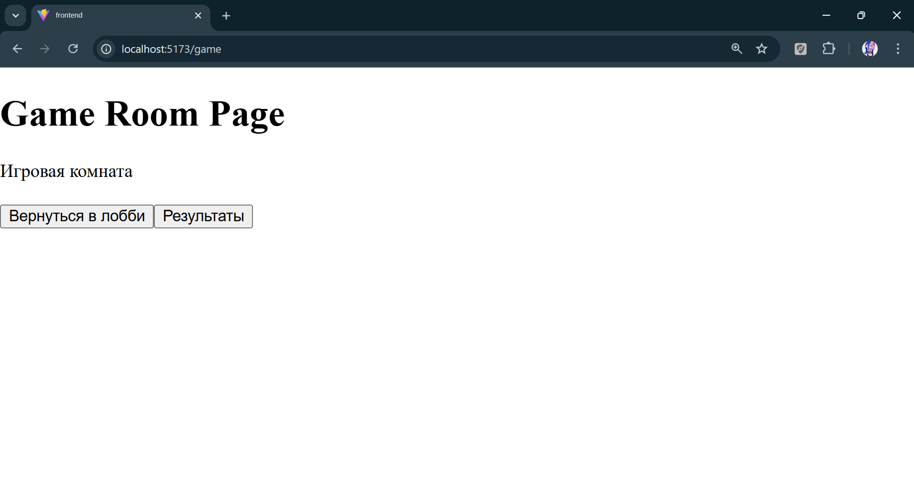
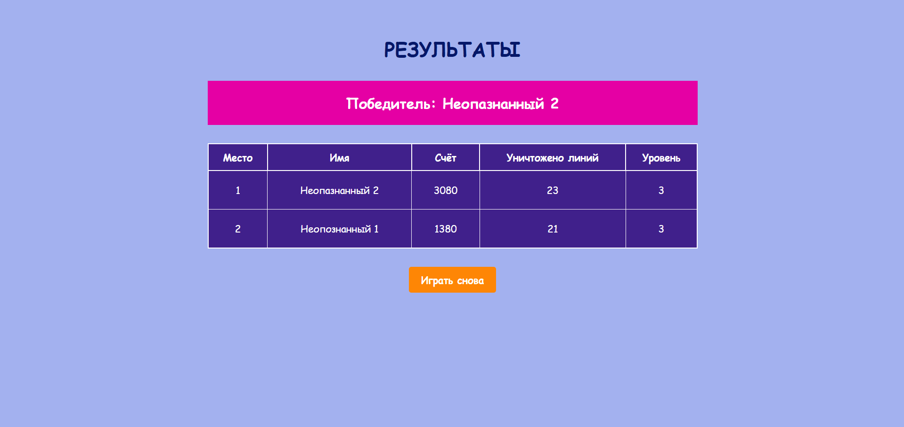

## Здесь происходит реализация архитектурных требований, описанных в файле ./architecture.md

## Инструкция к запуску

### Шаг 1.
```bash
cd ui-kit
npm install
```

### Шаг 2.
```bash
cd ../game-app
npm install
```

### Шаг 3.
```bash
cd ui-kit
npm run build
```

### Шаг 4.
```bash
cd game-app
npm run build
```

### Шаг 5.
```bash
cd game-app
npm run dev
```

## Тестирование
```bash
# Тестирование ui-kit
cd ui-kit && npm run test

# Тестирование game-app
cd game-app && npm run test
```

## Линтинг

```bash
# Линтинг ui-kit
cd ui-kit && npm run lint

# Линтинг game-app
cd game-app && npm run lint
```

## Должно получиться: (кнопки для удобства просмотра маршрутизации)
 

 


